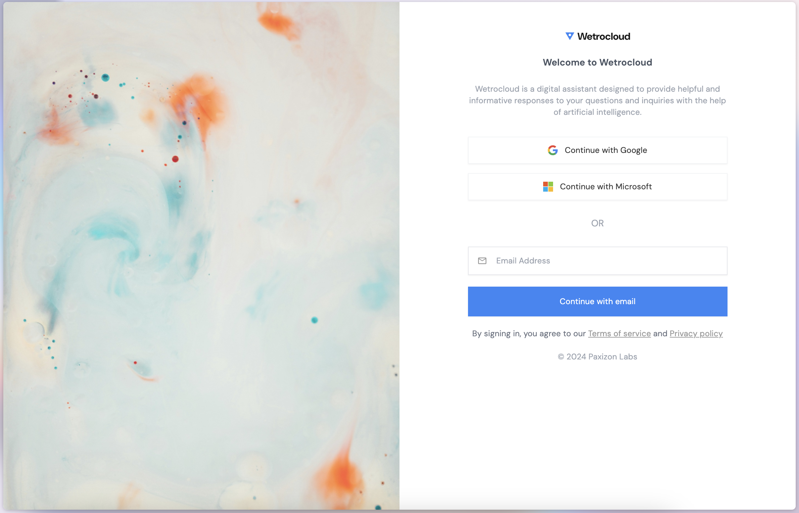
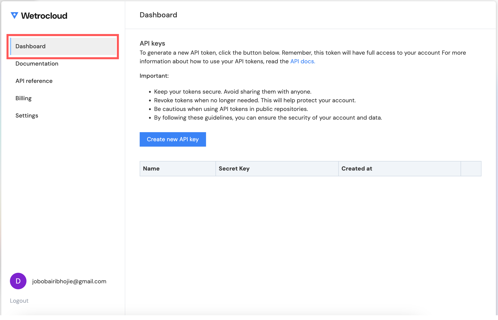
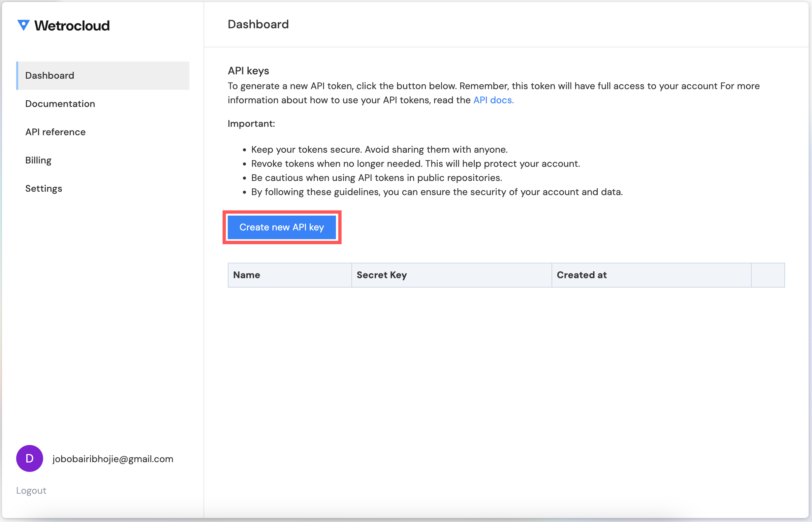
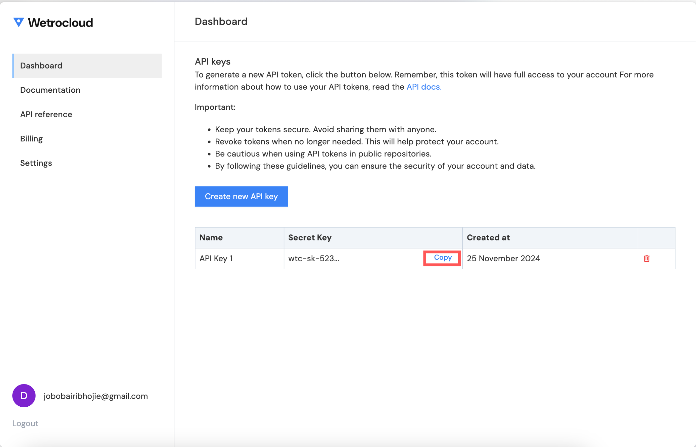

1. Open your browser and go to [Wetrocloud's Console](https://console.wetrocloud.com/).  

2. Click either of the social logins, or fill out your email address and click **Continue with email** to signup.
<Frame>
  
</Frame>  
3. Navigate to the **Dashboard** tab in your account dashboard.  
<Frame>
  
</Frame>
4. Click **Create new API Key** and provide a name for your key.  
<Frame>
  
</Frame>
5. Copy the generated API key and store it securely.  
<Frame>
  
</Frame>